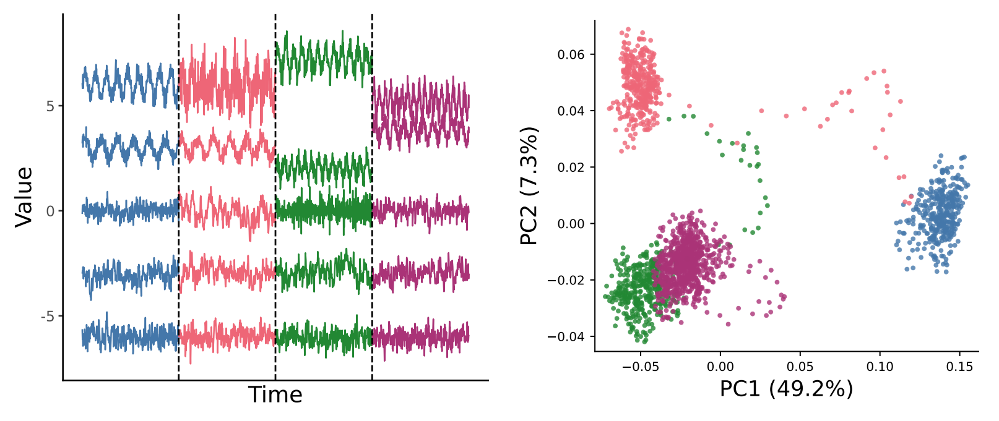
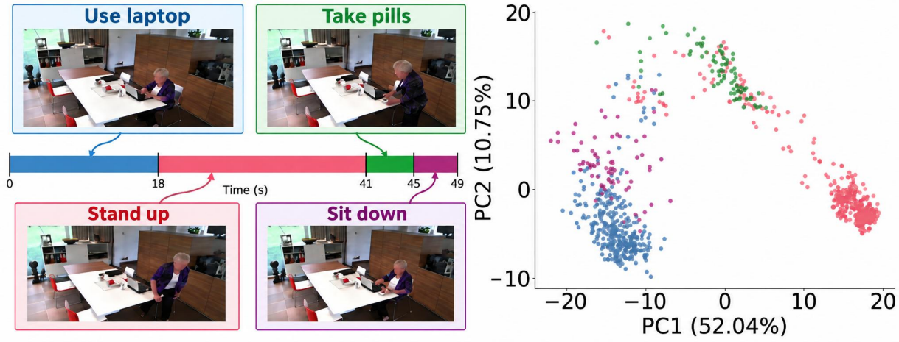

# Change-point detection using foundation models

This repository contains the code for **GAS-FM**, a training-free framework for change-point detection using frozen foundation-model representations. It supports both **time series** and **video**, and includes:
- representation extraction from pretrained foundation models,
- the GAS scalarization and change-point detection pipeline,
- the **change-encoding rate (CER)**, which measures how well latent representations preserve annotated changes, and
- configuration files and scripts to reproduce the experiments in the paper.

<table>
  <tr>
    <td width="50%">
      <a href="resources/timeseries_pair%20%288%29.pdf">
        
      </a>
    </td>
    <td width="50%">
      <a href="resources/video_pair%20%283%29.pdf">
        
      </a>
    </td>
  </tr>
</table>

## Quick start

Install the dependencies using `requirements.txt` for your foundation environment,
then install this package. 
```sh
python -m pip install -r requirements.txt
```

**Time-series foundation models**

| Model family | Variant / parameters | Hugging Face |
|---|---|---|
| Chronos-T5 | Tiny, 8M | [amazon/chronos-t5-tiny](https://huggingface.co/amazon/chronos-t5-tiny) |
| Chronos-T5 | Large, 710M | [amazon/chronos-t5-large](https://huggingface.co/amazon/chronos-t5-large) |
| Chronos-Bolt | Tiny, 9M | [amazon/chronos-bolt-tiny](https://huggingface.co/amazon/chronos-bolt-tiny) |
| Chronos-Bolt | Base, 205M | [amazon/chronos-bolt-base](https://huggingface.co/amazon/chronos-bolt-base) |
| Chronos-2 | 120M | [amazon/chronos-2](https://huggingface.co/amazon/chronos-2) |
| Moirai | Small | [Salesforce/moirai-1.0-R-small](https://huggingface.co/Salesforce/moirai-1.0-R-small) |
| Moirai | Large | [Salesforce/moirai-1.0-R-large](https://huggingface.co/Salesforce/moirai-1.0-R-large) |
| MOMENT | Small | [AutonLab/MOMENT-1-small](https://huggingface.co/AutonLab/MOMENT-1-small) |
| MOMENT | Large | [AutonLab/MOMENT-1-large](https://huggingface.co/AutonLab/MOMENT-1-large) |
| TimesFM | 1.0, 200M | [google/timesfm-1.0-200m-pytorch](https://huggingface.co/google/timesfm-1.0-200m-pytorch) |
| TimesFM | 2.5, 200M | [google/timesfm-2.5-200m-pytorch](https://huggingface.co/google/timesfm-2.5-200m-pytorch) |
| Moirai-MoE | Small | [Salesforce/moirai-moe-1.0-R-small](https://huggingface.co/Salesforce/moirai-moe-1.0-R-small) |


**Vision foundation models**

| Model | Notation | Hugging Face |
|---|---|---|
| DINO ViT-S/16 | DINO-S/16 | [facebook/dino-vits16](https://huggingface.co/facebook/dino-vits16) |
| DINO ViT-B/16 | DINO-B/16 | [facebook/dino-vitb16](https://huggingface.co/facebook/dino-vitb16) |
| DINOv2 ViT-S/14 | DINOv2-S/14 | [facebook/dinov2-small](https://huggingface.co/facebook/dinov2-small) |
| DINOv2 ViT-B/14 | DINOv2-B/14 | [facebook/dinov2-base](https://huggingface.co/facebook/dinov2-base) |


## Change Encoding Ratio (CER)

The Change Encoding Ratio (CER) measures whether an annotated change in the input sequence remains distinguishable in the foundation-model representation space. For each change point, CER compares the representation discrepancy between embeddings before and after the change with a reference discrepancy obtained from a no-change background sequence.

**Usage Example**

```python
from change_encoding_ratio import CER
from detection.core import run_embedding_pipeline
from detection.foundation_adapters import load_foundation_adapter

# target: (1200, 1) with changes at 400 (mean shift) and 800 (variance + period change)
# background: (1000, 1), same process as segment 1, no changes

adapter = load_foundation_adapter("chronos", "amazon/chronos-t5-tiny", "cpu")

target_emb = run_embedding_pipeline(target, adapter, window_size=128, stride=1)
background_emb = run_embedding_pipeline(background, adapter, window_size=128, stride=1)

cer = CER(
    latent_representations=target_emb.embeddings,           # (1073, 256)
    change_points=[400, 800],
    background_latent_representations=background_emb.embeddings,
    starts=target_emb.starts,
    ends=target_emb.ends - 1,                               
    background_starts=background_emb.starts,
    background_ends=background_emb.ends - 1,
    n_side=128,
)

rows = cer.evaluate()              
cer.score()                     
```


## Change-point detection with foundation models

The offline change-point detection pipeline includes latent representation extraction, denoising, univariate projection and detection using scan. The steps of running the foundation model detection pipelines are as follows:


1. **Update the configuration file.**

   Specify the foundation models you want to run and set the parameters for the
   SCAN univariate change-point detector for video and time-series data
   accordingly. Parameters can be selected by evaluating a parameter grid on a
   validation set before running the pipeline with the selected values.

   - `input.path`: path to your dataset.
   - `model.path`: local directory containing the downloaded model.
   - `embedding.context_length` and `embedding.stride`: context-window settings.
   - `embedding.device`: `cpu` or `cuda`.
   - `cpd.tv.weight`: TV smoothing strength.
   - `cpd.windows`: detector window settings.
   - `cpd.scan`: significance level, bootstrap count, and voting thresholds.
   - `output_dir`: folder for the results.

2. **Run the pipeline.**

   From the repository root:

   ```sh
   python -m detection --config configs/foundation.json
   ```

   The pipeline creates context windows, extracts embeddings, computes the
   projected statistics, and detects changes using SCAN within a unified framework.

3. **View the results.**

   Results are saved in the `output_dir` folder, including embeddings, denoised
   embeddings, the covariance matrix, projected univariate series in
   `statistics.npz`, and detected change points in `detections.json`.
